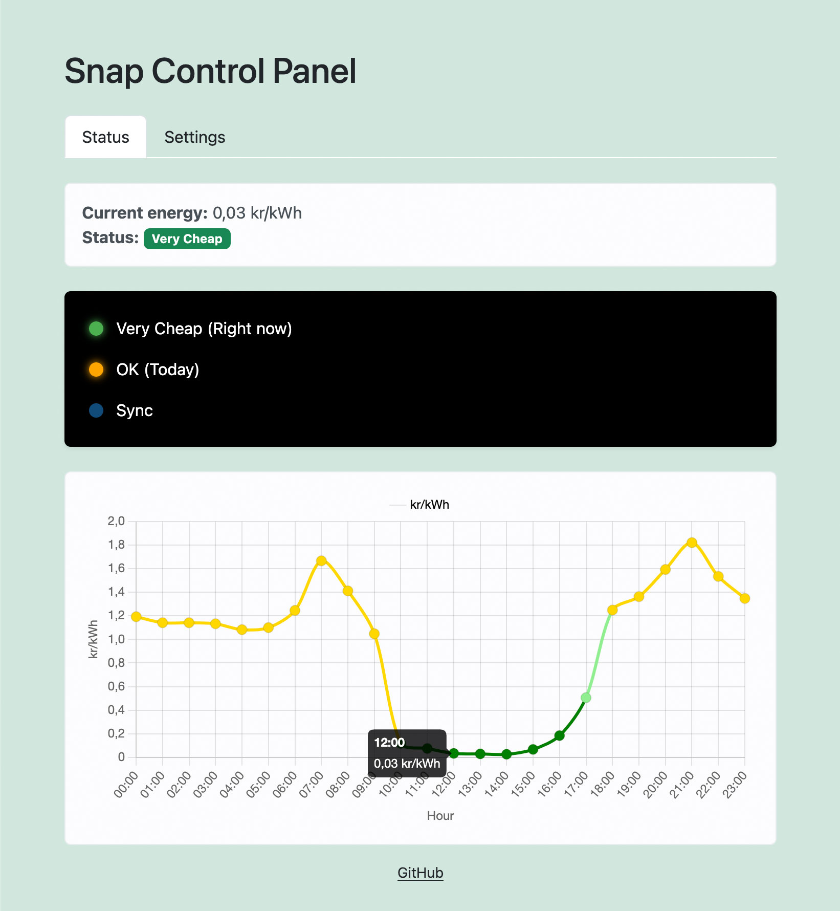

# Snap
Code and build instructions for [Snap](https://www.instagram.com/p/CVXhBlCs5un/), a simple Raspberry Pi and LED machine to show you how expensive the electricyty is at the moment. On row of LEDs shows the cost of the hour, the other row the cost of the day.

UPDATE: Added a [Wiz bulb](https://www.wizconnected.com/en-ca/products/bulbs) to show the eneryg cost too. Simply change the variable `ip` to the ip address of your bulb. If you don't want to use the Wiz, simply set `wiz` to `False`

UPDATE: Moved all settings to the snap-settings.json file

Like this.
1. Only Green = Very cheap
2. Green & Orange = Cheap
3. Only Orange = Ok
4. Orange & Red = Expensive
5. Only Red = Very expensive

## Setup

Install [Raspbian](https://www.raspberrypi.org/downloads/raspbian/) on a Raspberry Pi

### LED

Buy some [LEDs, wires and a breadboard](https://www.instagram.com/p/CU1-_8KsBTz/). I only used the [breadboard](https://www.instagram.com/p/CU7GH0gMow4/) while building.

Connect the LEDs to the GPIO pins of your liking, you can see which one I used in my script.

### Wiz

Install pip:

`sudo apt install python3-pip`

Install [pywizlight](https://github.com/sbidy/pywizlight)

`pip install pywizlight`

### The setup

Download the files and folders and put them in your home folder, for example /home/pi/.

Go to [Tibber](https://developer.tibber.com/settings/accesstoken) and get your Access Token.

Edit the downloaded settings file, and change YOUR-TOKEN-HERE to your Access Token.

If you have more than one home, change:
```
"home_index": 0
```
to reflect which home you are pulling data from. To see which home you want to use, go to [Tibbers Api Explorer](https://developer.tibber.com/explorer) and Load your personal token and simply run "Homes" in the drop down.

Change these settings in the settings file if you don't want to use the leds or a wiz light:
```
"led": true,
"wiz": true,
```

If you are using a wiz-light, make sure to change the host name and ip for it.

You can also change the breakpoints in the settings file too if you wish.

If you want the script to start automatically when the pi is booted run this command:

`crontab -e`

Answer `1`

Add this to the file:

`@reboot /usr/bin/python3 /home/snap/snap_runner.py &`

Restart your Pi and press watch the lights.

### Settings in a web UI



If you want to have a web UI for the settings run this command:

`crontab -e`

Answer `1`

Add this to the file:

`@reboot /bin/sleep 10; /usr/bin/python3 /home/snap/snap-settings-web-ui.py`

And also: 

`sudo visudo`

And then add this at the end of the file:

`pi ALL=(ALL) NOPASSWD: /sbin/reboot`

After that you can browse to http://YOUR-HOST:5000 and make the settings.

## Learn and experiment

If you want to change your script [Tibber has an excellent playground here](https://developer.tibber.com/explorer).

And here you can read more about [GraphQL Concepts](https://developer.tibber.com/docs/guides/graphql-concepts).

That's basically all I used for reference making this project. Good luck!
